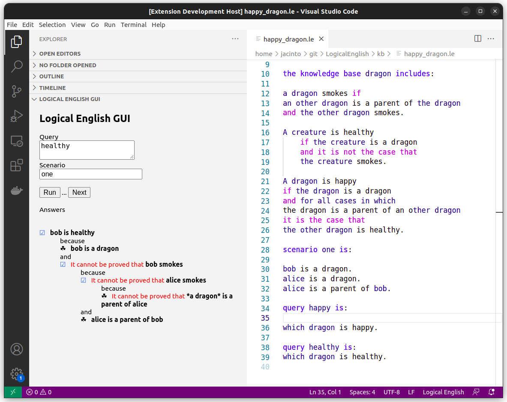
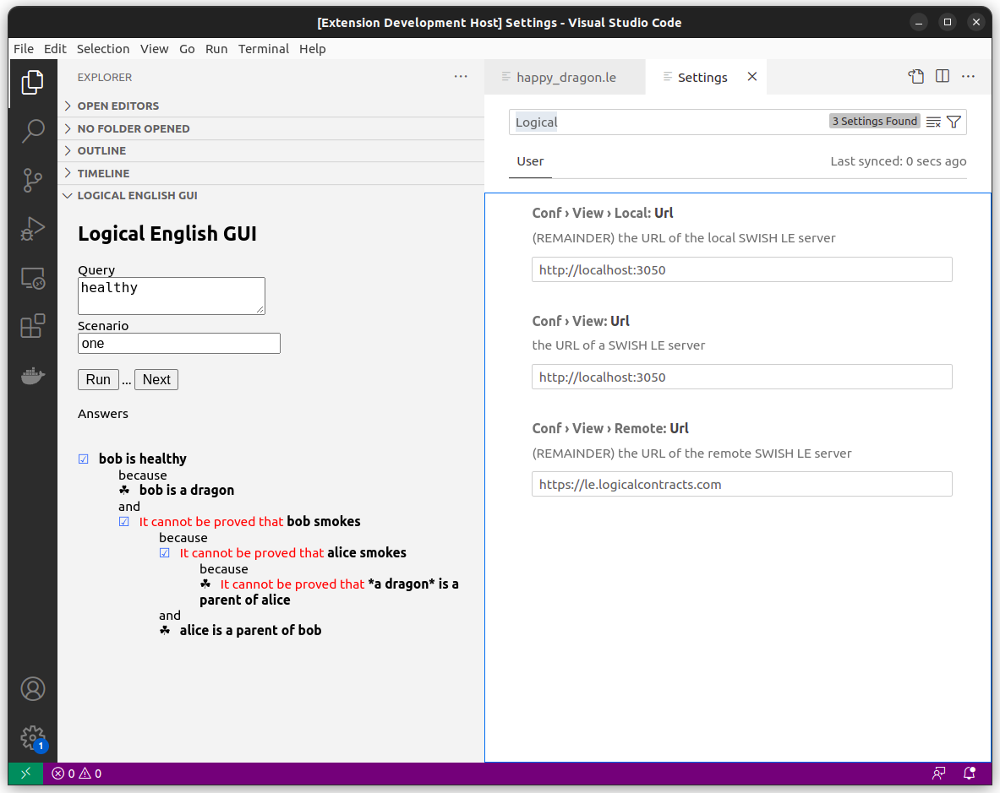

# Extension le-ui README

[Logical English](https://github.com/LogicalContracts/LogicalEnglish/), LE, is a controlled form of natural language that can be used for programming and knowledge representation. 

This extension "le-ui" provides a user interface within VSCODE to translate LE documents and queries into Prolog code that it is executed on a SWISH server (defined in the settings). The interaction occurs through a "webview" that is displayed as a collapsible tab in the Explorer view of Visual Studio. It could also be displayed as a side tab in the editor view, using a right-click, contextual-menu option. 

## Features

The extension provides a simple form with two input fields to query a LE document. Like this:

> Tip: In the Query field, the user can write the name of one of the queries in the document or write a direct query for the system. 
> Tip: The Scenario field must contain the name of a scenario, as described in the document, or being empty (meaning that no scenario is involved).  

To submit, simple press RUN. If the query has more than one answer, the botton NEXT will appear next to the RUN button. RUN NEXT produces an answer that is displayed in the space below. The tree of an *explanation* for the query is displayed by clicking on the small boxes next to each answer. 

## Requirements

A SWISH Prolog server must be up and running and must be referred to inside the extension as shown below. 

## Extension Settings

This extension contributes the following settings:

* `conf.view.url`: with the URL of the SWISH Prolog server that processes the document and answers the queries.

## Known Issues

Calling out known issues can help limit users opening duplicate issues against your extension.

## Release Notes

Version 1.0.0 is a beta testing version. 

### 1.0.0

Initial release of le-ui

---

## To run the extension

This extension is self-activating (by opening the Explorer->LE-UI tab). 

Experimentally, it can also be run by activating a separate panel from the right-click, contextual menu over an open document. Or, run the LE-UI command from the Command Palette (Ctrl+Shift+P) in the new window:

**Happy writing and querying!**
